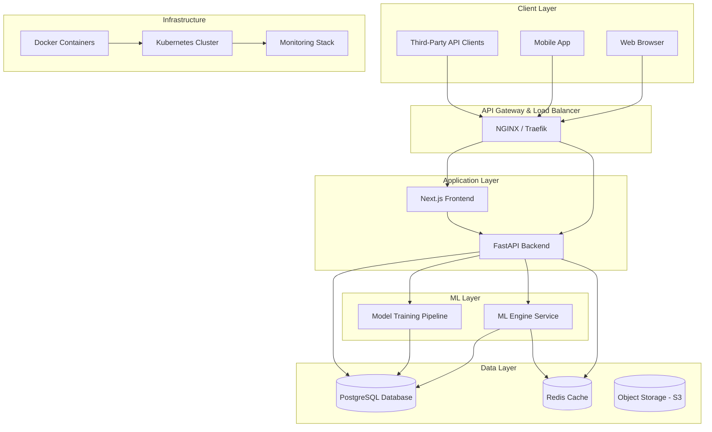

# System Architecture

## Overview

SpamGuard is a production-ready spam and fraud detection platform built with a microservices-inspired architecture. The system consists of a modern web frontend, a robust backend API, a machine learning engine, and supporting infrastructure components.

## High-Level Architecture

## Component Details

### Frontend (Next.js + React)
- **Technology**: Next.js 14, React 18, TypeScript
- **Styling**: TailwindCSS, ShadCN UI components
- **Features**:
  - Responsive dashboard
  - Real-time API testing playground
  - Data visualization with Recharts
  - User authentication flows
  - File upload for dataset training
- **Deployment**: Static export or server-side rendering

### Backend (FastAPI)
- **Technology**: FastAPI, Python 3.11
- **Features**:
  - REST API endpoints
  - GraphQL API with Strawberry
  - JWT authentication
  - Rate limiting by subscription tier
  - Background task processing
- **Modules**:
  - Authentication & Authorization
  - User Management
  - API Rate Limiting
  - Webhook Notifications
  - Logging & Monitoring

### ML Engine
- **Technology**: scikit-learn, PyTorch, HuggingFace Transformers
- **Components**:
  - Text preprocessing pipeline (TF-IDF, embeddings)
  - Supervised learning models (Logistic Regression, Transformer fine-tuning)
  - Model evaluation (precision, recall, F1, ROC-AUC)
  - Retraining pipeline
  - Explainability features (keyword highlighting)
- **Data Flow**:
  1. Raw text input
  2. Preprocessing (tokenization, cleaning, feature extraction)
  3. Model prediction
  4. Post-processing (confidence scores, explanations)

### Database Schema
- **Primary Database**: PostgreSQL
- **Tables**:
  - users (authentication, profiles, subscriptions)
  - api_keys (rate limiting, usage tracking)
  - predictions (history, logs)
  - datasets (training data uploads)
  - models (versions, metadata)
- **Caching**: Redis for sessions, API responses, rate limits

### External Integrations
- **Payment Processing**: Stripe/PayPal
- **Email Notifications**: SendGrid/Mailgun
- **Monitoring**: Prometheus + Grafana
- **Logging**: ELK Stack or CloudWatch

## Data Flow

### Prediction Request Flow
1. Client sends prediction request to API
2. Authentication middleware validates JWT
3. Rate limiting checks subscription tier
4. Request forwarded to ML engine
5. ML engine processes text and returns prediction
6. Response includes label, confidence, and explanations
7. Prediction logged to database
8. Webhook notifications sent if configured

### Training Flow
1. Admin uploads labeled dataset
2. Data validated and stored
3. Background job triggers retraining
4. Model trained on new data
5. Model evaluated and deployed
6. Old model archived
7. Users notified of model update

## Security Architecture

- **Authentication**: JWT tokens with refresh mechanism
- **Authorization**: Role-based access control (admin, business, free)
- **API Security**: API keys, rate limiting, input validation
- **Data Security**: Encryption at rest, HTTPS everywhere
- **Infrastructure Security**: VPC isolation, security groups, secrets management

## Scalability Considerations

- **Horizontal Scaling**: Kubernetes pods for backend and ML services
- **Caching Strategy**: Redis for hot data, CDN for static assets
- **Database Scaling**: Read replicas, connection pooling
- **ML Scaling**: Model serving with multiple instances, batch processing for training

## Deployment Architecture

- **Containerization**: Docker for all services
- **Orchestration**: Kubernetes with Helm charts
- **CI/CD**: GitHub Actions for automated testing and deployment
- **Cloud Providers**: AWS/GCP/Azure with multi-region support
- **Monitoring**: Prometheus metrics, Grafana dashboards, alerting

## Performance Targets

- API Response Time: <200ms for predictions
- Throughput: 1000 requests/second
- Model Training Time: <30 minutes for incremental updates
- Uptime: 99.9% SLA
- Data Retention: 1 year for logs, indefinite for user data