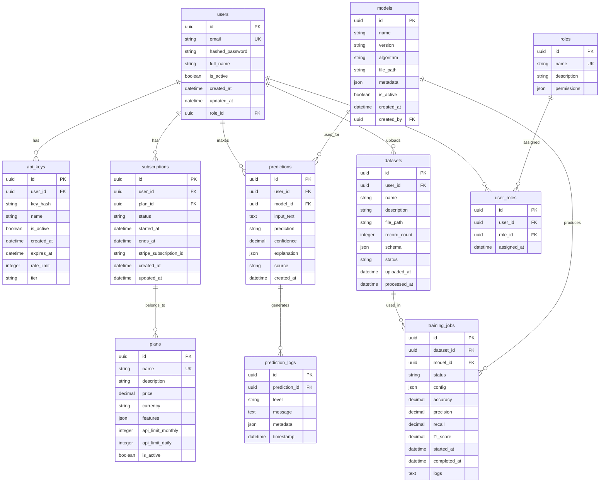

# Database Schema

## Overview

The SpamGuard platform uses PostgreSQL as the primary database with Redis for caching. The schema is designed for scalability, security, and performance.

## Entity-Relationship Diagram

## Table Definitions

### users
Stores user account information and authentication details.

| Column | Type | Constraints | Description |
|--------|------|-------------|-------------|
| id | UUID | PRIMARY KEY | Unique user identifier |
| email | VARCHAR(255) | UNIQUE, NOT NULL | User email address |
| hashed_password | VARCHAR(255) | NOT NULL | Bcrypt hashed password |
| full_name | VARCHAR(255) | NOT NULL | User's full name |
| is_active | BOOLEAN | DEFAULT TRUE | Account activation status |
| created_at | TIMESTAMP | DEFAULT NOW() | Account creation timestamp |
| updated_at | TIMESTAMP | DEFAULT NOW() | Last update timestamp |
| role_id | UUID | FOREIGN KEY | Reference to roles table |

### roles
Defines user roles and their permissions.

| Column | Type | Constraints | Description |
|--------|------|-------------|-------------|
| id | UUID | PRIMARY KEY | Unique role identifier |
| name | VARCHAR(50) | UNIQUE, NOT NULL | Role name (admin, business, free) |
| description | TEXT | | Role description |
| permissions | JSONB | | JSON object defining permissions |

### api_keys
Manages API keys for third-party access.

| Column | Type | Constraints | Description |
|--------|------|-------------|-------------|
| id | UUID | PRIMARY KEY | Unique key identifier |
| user_id | UUID | FOREIGN KEY, NOT NULL | Owner of the API key |
| key_hash | VARCHAR(255) | UNIQUE, NOT NULL | Hashed API key |
| name | VARCHAR(100) | NOT NULL | Human-readable key name |
| is_active | BOOLEAN | DEFAULT TRUE | Key activation status |
| created_at | TIMESTAMP | DEFAULT NOW() | Creation timestamp |
| expires_at | TIMESTAMP | | Key expiration date |
| rate_limit | INTEGER | DEFAULT 1000 | Requests per hour |
| tier | VARCHAR(20) | DEFAULT 'free' | Subscription tier |

### plans
Defines subscription plans and pricing.

| Column | Type | Constraints | Description |
|--------|------|-------------|-------------|
| id | UUID | PRIMARY KEY | Unique plan identifier |
| name | VARCHAR(100) | UNIQUE, NOT NULL | Plan name |
| description | TEXT | | Plan description |
| price | DECIMAL(10,2) | NOT NULL | Monthly price |
| currency | VARCHAR(3) | DEFAULT 'USD' | Currency code |
| features | JSONB | | JSON object with plan features |
| api_limit_monthly | INTEGER | | Monthly API call limit |
| api_limit_daily | INTEGER | | Daily API call limit |
| is_active | BOOLEAN | DEFAULT TRUE | Plan availability |

### subscriptions
Tracks user subscriptions to plans.

| Column | Type | Constraints | Description |
|--------|------|-------------|-------------|
| id | UUID | PRIMARY KEY | Unique subscription identifier |
| user_id | UUID | FOREIGN KEY, NOT NULL | Subscriber |
| plan_id | UUID | FOREIGN KEY, NOT NULL | Subscribed plan |
| status | VARCHAR(20) | DEFAULT 'active' | Subscription status |
| started_at | TIMESTAMP | NOT NULL | Subscription start date |
| ends_at | TIMESTAMP | | Subscription end date |
| stripe_subscription_id | VARCHAR(255) | | Stripe subscription ID |
| created_at | TIMESTAMP | DEFAULT NOW() | Creation timestamp |
| updated_at | TIMESTAMP | DEFAULT NOW() | Last update timestamp |

### datasets
Stores uploaded training datasets.

| Column | Type | Constraints | Description |
|--------|------|-------------|-------------|
| id | UUID | PRIMARY KEY | Unique dataset identifier |
| user_id | UUID | FOREIGN KEY, NOT NULL | Uploader |
| name | VARCHAR(255) | NOT NULL | Dataset name |
| description | TEXT | | Dataset description |
| file_path | VARCHAR(500) | NOT NULL | File storage path |
| record_count | INTEGER | | Number of records |
| schema | JSONB | | Dataset schema definition |
| status | VARCHAR(20) | DEFAULT 'uploaded' | Processing status |
| uploaded_at | TIMESTAMP | DEFAULT NOW() | Upload timestamp |
| processed_at | TIMESTAMP | | Processing completion timestamp |

### models
Stores trained ML models and metadata.

| Column | Type | Constraints | Description |
|--------|------|-------------|-------------|
| id | UUID | PRIMARY KEY | Unique model identifier |
| name | VARCHAR(255) | NOT NULL | Model name |
| version | VARCHAR(50) | NOT NULL | Model version |
| algorithm | VARCHAR(100) | NOT NULL | ML algorithm used |
| file_path | VARCHAR(500) | NOT NULL | Model file path |
| metadata | JSONB | | Model metadata (accuracy, etc.) |
| is_active | BOOLEAN | DEFAULT FALSE | Active model flag |
| created_at | TIMESTAMP | DEFAULT NOW() | Creation timestamp |
| created_by | UUID | FOREIGN KEY, NOT NULL | Creator user ID |

### predictions
Logs all prediction requests and results.

| Column | Type | Constraints | Description |
|--------|------|-------------|-------------|
| id | UUID | PRIMARY KEY | Unique prediction identifier |
| user_id | UUID | FOREIGN KEY, NOT NULL | Requesting user |
| model_id | UUID | FOREIGN KEY, NOT NULL | Model used |
| input_text | TEXT | NOT NULL | Input text for prediction |
| prediction | VARCHAR(20) | NOT NULL | Prediction result |
| confidence | DECIMAL(5,4) | | Prediction confidence score |
| explanation | JSONB | | Explanation data |
| source | VARCHAR(50) | DEFAULT 'api' | Request source |
| created_at | TIMESTAMP | DEFAULT NOW() | Prediction timestamp |

## Indexes

### Performance Indexes
- users.email (UNIQUE)
- users.role_id
- api_keys.user_id
- api_keys.key_hash (UNIQUE)
- subscriptions.user_id
- subscriptions.plan_id
- datasets.user_id
- predictions.user_id
- predictions.model_id
- predictions.created_at
- models.is_active

### Composite Indexes
- api_keys(user_id, is_active)
- subscriptions(user_id, status)
- predictions(user_id, created_at)

## Constraints

### Check Constraints
- users.email: Valid email format
- subscriptions.status: IN ('active', 'canceled', 'past_due', 'incomplete')
- datasets.status: IN ('uploaded', 'processing', 'processed', 'failed')
- predictions.prediction: IN ('spam', 'ham', 'fraud', 'legitimate')

### Foreign Key Constraints
- All foreign keys with CASCADE DELETE where appropriate
- ON DELETE RESTRICT for critical data relationships

## Data Retention

- predictions: 1 year rolling window
- prediction_logs: 90 days
- training_jobs: Indefinite (for model lineage)
- api_keys: Indefinite (for audit trail)

## Backup Strategy

- Daily full backups
- Hourly incremental backups for critical tables
- Point-in-time recovery capability
- Cross-region replication for disaster recovery